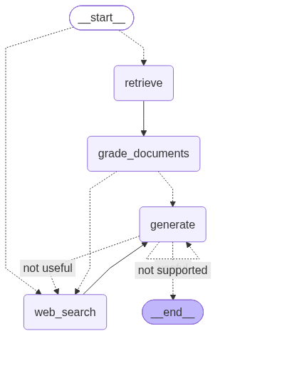
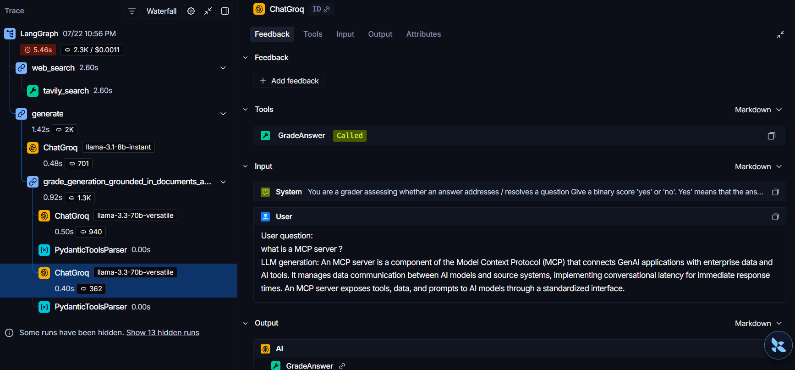
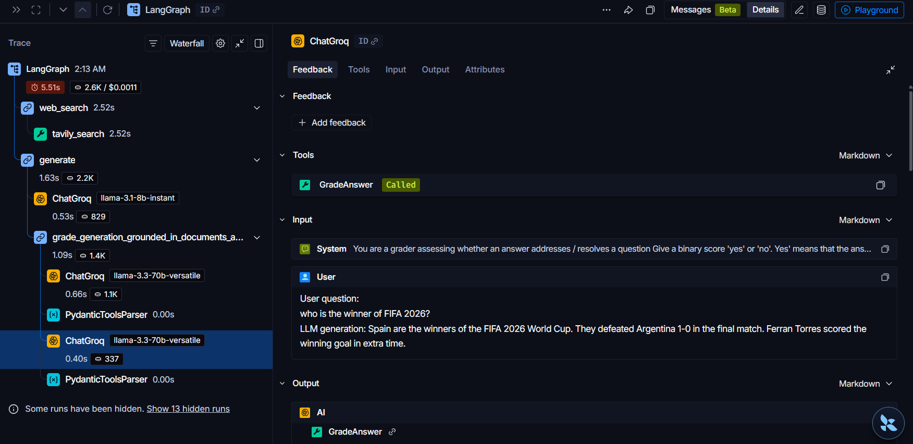

# Advanced RAG Pipeline with LangGraph

An advanced Retrieval-Augmented Generation (RAG) system that combines **Adaptive RAG**, **Corrective RAG**, and **Self-RAG** into a single self-correcting pipeline, built with **LangGraph**, **LangChain**, **Groq (Llama 3)**, and **Qdrant**.

Given a user question, the system doesn't just retrieve-and-generate blindly — it *routes* the question to the right data source, *grades* retrieved documents for relevance, falls back to *web search* when the knowledge base doesn't have an answer, and *checks its own output* for hallucinations before returning it.

## Why This Project

Most beginner RAG projects are a single retrieve → generate call with no way to recover when retrieval fails or the model hallucinates. This project addresses that gap directly: it's a **self-correcting RAG system** that knows when its own knowledge base isn't enough, and knows how to verify its own answers before returning them. That's the difference between a demo and something closer to a production RAG pipeline — it's the kind of reasoning and reliability layer real applications need on top of a basic LLM call.

## Architecture



The pipeline is a state graph with the following flow:

1. **Route Question** (Adaptive RAG) — An LLM classifies the incoming question and decides whether it should be answered from the vectorstore (ingested documents) or from live web search.
2. **Retrieve** — Fetches candidate chunks from Qdrant using dense vector similarity search.
3. **Rerank** — A cross-encoder reranker re-scores the retrieved chunks against the question and keeps only the top-k most relevant ones.
4. **Grade Documents** (Corrective RAG) — Each retrieved document is graded by an LLM for relevance to the question. If any document is judged irrelevant, the pipeline flags that a web search is needed to supplement the answer.
5. **Web Search** — Uses Tavily to fetch fresh, relevant context when the vectorstore's documents aren't sufficient, or when the question is entirely outside the ingested knowledge base.
6. **Generate** — Produces an answer conditioned on the (filtered/augmented) documents.
7. **Grade Generation** (Self-RAG) — The generated answer is checked twice:
   - **Hallucination check**: is the generation actually grounded in the retrieved documents?
   - **Answer relevance check**: does the generation actually address the user's question?
   - If the generation is not grounded, the pipeline retries generation. If it's grounded but doesn't answer the question, it falls back to web search.

This creates a **self-correcting loop** rather than a single-shot RAG call.

## RAG Techniques Used

| Technique | What it does | Where |
|---|---|---|
| **Adaptive RAG** | Routes each question to vectorstore or web search based on topic, instead of always retrieving | `chains/router.py`, `route_question()` in `graph.py` |
| **Corrective RAG** | Grades retrieved documents; triggers web search if documents are irrelevant | `chains/retrieve_grader.py`, `nodes/grade_documents.py` |
| **Self-RAG** | Grades the final generation for hallucination and answer-relevance, retrying or re-routing as needed | `chains/hallucination_grader.py`, `chains/answer_grader.py` |
| **Reranking** | A cross-encoder (`BAAI/bge-reranker-base`) re-scores retrieved chunks against the query for tighter relevance ordering before generation | `retrieval/reranker.py` |

## Tech Stack

- **Orchestration:** LangGraph, LangChain
- **LLMs:** Groq — Llama 3.1 8B Instant (generation), Llama 3.3 70B Versatile (grading/routing)
- **Vector Store:** Qdrant
- **Embeddings:** HuggingFace `BAAI/bge-base-en-v1.5`
- **Reranker:** `BAAI/bge-reranker-base` (cross-encoder)
- **Web Search:** Tavily
- **Observability:** LangSmith

## Project Structure

```
RAGadvance/
├── graph/
│   ├── chains/
│   │   ├── tests/
│   │   │   ├── __init__.py
│   │   │   └── test_chains.py
│   │   ├── __init__.py
│   │   ├── answer_grader.py
│   │   ├── generation.py
│   │   ├── hallucination_grader.py
│   │   ├── retrieve_grader.py
│   │   └── router.py
│   ├── nodes/
│   │   ├── __init__.py
│   │   ├── generate.py
│   │   ├── grade_documents.py
│   │   ├── retrieve.py
│   │   └── web_search.py
│   ├── retrieval/
│   │   ├── __init__.py
│   │   └── reranker.py
│   ├── __init__.py
│   ├── constants.py
│   ├── graph.py
│   └── state.py
├── .env.adv
├── __init__.py
├── adv_ingestion.py
├── graph.png
├── mainn.py
└── qdrant_db.py
```

## Setup

1. Clone the repo and create a virtual environment.
2. Install dependencies:
   ```bash
   pip install -r requirements.txt
   ```
3. Copy `.env.example` to `.env.adv` and fill in your keys:
   ```
   GROQ_API_KEY=
   QDRANT_URL=
   QDRANT_API_KEY=
   TAVILY_API_KEY=
   LANGCHAIN_TRACING_V2=true
   LANGCHAIN_API_KEY=
   LANGCHAIN_PROJECT=advanced-rag-project
   ```
4. Ingest source documents into Qdrant:
   ```bash
   python adv_ingestion.py
   ```
5. Run a query through the pipeline:
   ```bash
   python mainn.py
   ```

> Qdrant can be run locally via Docker (`qdrant/qdrant` image) or via a free-tier [Qdrant Cloud](https://cloud.qdrant.io/) cluster.

## Observability — LangSmith Tracing

This project uses [LangSmith](https://smith.langchain.com) to trace and debug the full LangGraph execution — every routing decision, retrieval call, grading step, and retry is logged, making it possible to inspect exactly *why* the graph took a particular path (e.g. why it fell back to web search, or why a generation was flagged as ungrounded).

To enable tracing, add the LangSmith variables shown in the Setup section above to `.env.adv`. Traces then appear at [smith.langchain.com](https://smith.langchain.com) under your configured project.

### Example Traces

**1. Question answerable from ingested documents** — *"What is a MCP server?"*
The router sends this to the vectorstore, retrieval succeeds, and the generation passes both the hallucination and answer-relevance checks on the first attempt.

> LLM generation: *An MCP server is a component of the Model Context Protocol (MCP) that connects GenAI applications with enterprise data and AI tools. It manages data communication between AI models and source systems...*



[View live trace](https://smith.langchain.com/o/3ea00551-6c5b-43ef-86a8-8f79c2eca314/projects/p/7785127b-0650-4af1-88a7-75fefd494219?timeModel=%7B%22duration%22%3A%221d%22%7D&peek=019f8add-1003-7aa1-9b56-d28d4bd709e6&peek_start=2026-07-22T17%3A26%3A11.203861Z&peek_project=7785127b-0650-4af1-88a7-75fefd494219&peeked_trace=019f8adc-fc38-7050-ac22-dc993f13cad9&scroll_to=feedback) *(requires LangSmith project access)*

**2. Question with no relevance to ingested documents** — *"Who is the winner of FIFA 2026?"*
The retrieved documents are graded as irrelevant, so the pipeline falls back to `web_search` (Tavily) instead of forcing an answer from an unrelated knowledge base, then generates and grades the answer as before.



[View live trace](https://smith.langchain.com/o/3ea00551-6c5b-43ef-86a8-8f79c2eca314/projects/p/7785127b-0650-4af1-88a7-75fefd494219?timeModel=%7B%22duration%22%3A%221d%22%7D&peek=019f8b91-8e99-7281-81eb-dc97619e3900&peek_start=2026-07-22T20%3A43%3A20.089411Z&peek_project=7785127b-0650-4af1-88a7-75fefd494219&peeked_trace=019f8b91-7aa6-7331-84f4-1b811a518212) *(requires LangSmith project access)*

Both traces show the full node-by-node execution — retrieval, grading, generation, and the hallucination/answer-relevance checks — with token counts and latency per step.

## Future Improvements

- Streamlit interface for user-provided URLs and questions
- Hybrid (dense + sparse) search in Qdrant for improved keyword-level recall
- Error handling for API timeouts

## License

MIT
